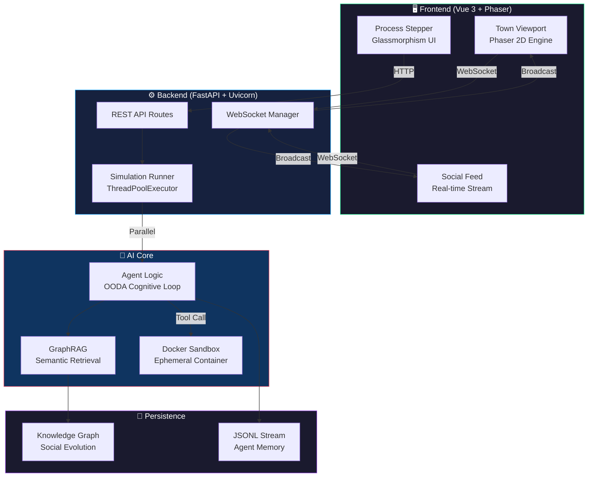

<div align="center">

# 🌐 Swarm-Sim Engine

### Multi-Agent Behavioral Simulation & Observability Platform

[](https://python.org)
[](https://fastapi.tiangolo.com)
[](https://vuejs.org)
[](https://docker.com)
[](.github/workflows/ci.yml)
[](LICENSE)

**一个领域无关的多智能体仿真引擎，让 AI Agent 在可视化虚拟世界中自主感知、推理、社交和执行代码。**

*Autonomous agents with OODA cognitive loops, Docker-sandboxed code execution, GraphRAG memory, and real-time 2D visual observability.*

---

[快速开始](#-快速开始) · [核心架构](#-核心架构) · [技术亮点](#-技术亮点) · [工程化体系](#-工程化体系) · [项目结构](#-项目结构)

</div>

---

## ⚡ 30 秒了解 Swarm-Sim

> **传统多智能体系统**：Agent 在终端里吐日志，你只能盯着文字猜它在干什么。
>
> **Swarm-Sim Engine**：Agent 在一个 2D 虚拟小镇里行走、社交、思考、写代码，你**实时看到一切**。

```
📂 上传数据 → 🧠 LLM 生成知识图谱 → 🤖 Agent 自主协作 → 🐳 沙箱执行代码 → 📊 审计报告
```

---

## 🏗️ 核心架构



---

## 🔥 技术亮点

<table>
<tr>
<td width="50%">

### 🧠 OODA 认知循环引擎
每个 Agent 内置完整的 **OODA Loop**（Observe → Orient → Decide → Act）认知框架。Agent 不是简单地调用 LLM 生成文本，而是：
- **观察** 自身记忆流和知识图谱上下文
- **定位** 根据角色性格做出判断
- **决策** 选择沟通、行动还是执行代码
- **行动** 输出结构化 JSON Action

</td>
<td width="50%">

### 🐳 Docker 安全沙箱
Agent 可以动态生成 Python 脚本并在完全隔离的 Docker 容器中执行：
- `python:3.9-alpine` 轻量级基础镜像
- **CPU 0.5 核 / 内存 128MB** 硬限制
- **网络完全禁用** (`network_mode: none`)
- 脚本以**只读方式**挂载
- 执行后**强制销毁**容器

</td>
</tr>
<tr>
<td width="50%">

### 📊 GraphRAG 语义检索
不是传统的 RAG 文本检索，而是基于**知识图谱拓扑**的语义增强：
- 遍历 Agent 社交图谱的边
- 反查目标节点的完整属性和描述
- 将拓扑上下文注入 Agent 记忆流
- Agent 获得**跨实体的深度认知能力**

</td>
<td width="50%">

### 🎮 Phaser 行为可观测性
创新性地集成 **Phaser 2D 游戏引擎**：
- Agent 以像素精灵的形式在小镇中移动
- 实时渲染行动轨迹、社交行为
- 头顶显示内心思考和情绪状态
- 点击 Agent 可发起实时对话
- 提供传统日志无法呈现的**空间直觉**

</td>
</tr>
<tr>
<td width="50%">

### ⚡ 实时 WebSocket 流
抛弃传统 HTTP 轮询，全面拥抱双向流：
- FastAPI 原生 WebSocket 端点
- `ConnectionManager` 管理多路连接
- Agent 思考过程以 **~50ms** 延迟推送
- 支持多组件同时订阅同一流

</td>
<td width="50%">

### 🔄 动态社交图谱演化
Agent 之间的关系不是静态配置，而是**自进化**的：
- 每次交互后自动更新边权重
- 语义摘要随对话演进
- 图谱结构反过来影响 Agent 决策
- 形成 **感知 → 行动 → 图谱 → 感知** 的闭环

</td>
</tr>
</table>

---

## 🏭 工程化体系

本项目不仅是一个 Demo，更是一个具备**工业级工程化标准**的完整系统：

| 维度 | 工具 | 说明 |
|:---|:---|:---|
| 📦 **容器编排** | Docker Compose | 一键拉起 Backend + Frontend + Nginx，挂载 Docker Socket 支持沙箱 |
| 🔄 **CI/CD** | GitHub Actions | 3 阶段流水线：后端 (Ruff+Pytest) → 前端 (ESLint+Vitest) → Docker Build |
| 🧹 **代码质量** | Ruff + ESLint | Python 静态分析 + TypeScript/Vue 3 lint，统一代码风格 |
| 🔧 **统一工作流** | Makefile | `make dev` / `make up` / `make test` / `make lint` / `make format` |
| 🌐 **反向代理** | Nginx | 统一入口，`/api/` 转发至后端，原生支持 WebSocket Upgrade |
| 🩺 **健康检查** | `/health` | 容器就绪探针 |
| 📝 **结构化日志** | Loguru | 带 `simulation_id` 上下文的结构化日志 |

---

## 🚀 快速开始

### 方式一：本地开发（推荐）

```bash
# 1. 克隆仓库
git clone https://github.com/QUSETIONS/swarm-sim-engine.git
cd swarm-sim-engine

# 2. 启动后端
cd backend
python -m venv .venv
.venv\Scripts\activate        # Windows
# source .venv/bin/activate   # macOS/Linux
pip install -e ".[dev]"
python run.py                 # 🟢 Backend running at http://localhost:5000

# 3. 启动前端（新终端）
cd frontend
npm install
npm run dev                   # 🟢 Frontend running at http://localhost:5173
```

### 方式二：Docker Compose（一键部署）

```bash
# 复制环境配置
cp .env.example .env

# 一键启动全部服务
make up
# 或
docker compose -f docker-compose.dev.yml up -d

# 🟢 Frontend: http://localhost:3000
# 🟢 Backend:  http://localhost:5000
```

### 方式三：Makefile 快捷入口

```bash
make dev      # 本地开发模式
make up       # Docker 启动
make down     # Docker 停止
make test     # 运行全部测试
make lint     # 代码质量检查
make format   # 自动格式化
make help     # 查看所有命令
```

---

## 📂 项目结构

```
swarm-sim-engine/
├── .github/workflows/
│   └── ci.yml                    # GitHub Actions CI/CD Pipeline
├── backend/
│   ├── app/
│   │   ├── api/                  # FastAPI Route Handlers
│   │   │   ├── graph.py          #   Ontology & Graph endpoints
│   │   │   ├── simulation.py     #   Simulation lifecycle
│   │   │   ├── report.py         #   Report generation
│   │   │   └── ws.py             #   WebSocket Manager
│   │   ├── services/             # Core Business Logic
│   │   │   ├── agent_logic.py    #   OODA Cognitive Engine
│   │   │   ├── retrieval_tools.py#   GraphRAG Retrieval
│   │   │   ├── sandbox_executor.py# Docker Sandbox
│   │   │   ├── simulation_runner.py# Parallel Runner
│   │   │   └── graph_evolver.py  #   Social Graph Evolution
│   │   ├── models/               # Data Persistence Layer
│   │   └── utils/                # LLM Client, File Parser
│   ├── tests/                    # Pytest Suite
│   ├── Dockerfile                # Python 3.11 + Uvicorn
│   └── pyproject.toml            # Dependencies & Ruff Config
├── frontend/
│   ├── src/
│   │   ├── api/                  # Axios + WebSocket Client
│   │   ├── components/           # Vue 3 SFC Components
│   │   │   ├── TownViewport.vue  #   Phaser Integration
│   │   │   ├── SocialFeed.vue    #   Real-time Feed
│   │   │   └── Step*.vue         #   Workflow Steps
│   │   ├── game/                 # Phaser Game Engine
│   │   │   ├── TownManager.ts    #   Scene Orchestrator
│   │   │   └── AgentSprite.ts    #   Agent Visual Entity
│   │   └── views/                # Page-level Components
│   ├── Dockerfile                # Multi-stage (Node 20 → Nginx)
│   ├── nginx.conf                # Reverse Proxy Config
│   └── tsconfig.json             # TypeScript Configuration
├── docker-compose.dev.yml        # Full-stack Orchestration
├── Makefile                      # Unified Workflow Commands
└── .env.example                  # Environment Template
```

---

## 🧪 测试

```bash
# 后端单元测试
cd backend && pytest tests -v

# 前端组件测试
cd frontend && npm run test

# 全栈测试（via Makefile）
make test
```

---

## 📄 License

MIT License — Feel free to use, modify, and distribute.

---

<div align="center">

**Built with 🔥 by [QUSETIONS](https://github.com/QUSETIONS)**

*"Let AI agents live in a world you can see."*

</div>
